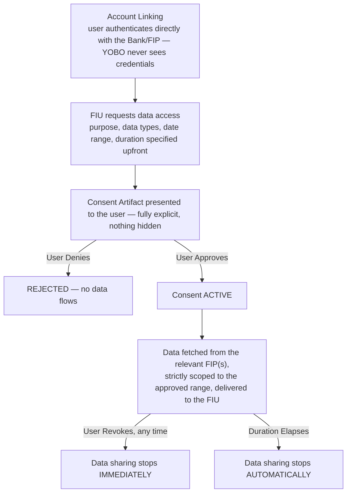

# 🏦 YOBO — Your Only Banking Option

**A consent-based Account Aggregator (AA) banking platform — QA & Automation Portfolio Project**

> This repository documents the QA strategy, test automation, and testing approach applied to a
> sample **Account Aggregator platform** (similar in concept to services like Cred or Finvu) that
> lets users securely link accounts across multiple banks/financial institutions and share a
> real-time, consent-governed view of that data with apps or lenders they trust.
>
> All content here uses **generic/sample data only**. No client names, company names, or
> confidential/production information are included. Dates and timelines are placeholders —
> update `[Timeline]` before publishing.
>
> 📍 **New here?** [`docs/README.md`](./docs/README.md) is a documentation map answering "what is
> this, how does it work, who's involved, what does it depend on" — with a recommended reading
> order through every doc in this repo.

---

## 📖 Table of Contents

1. [What is an Account Aggregator?](#-what-is-an-account-aggregator)
2. [My Role](#-my-role)
3. [Tech Stack & Tools Used](#-tech-stack--tools-used)
4. [Types of Testing Performed](#-types-of-testing-performed)
5. [How It Works — Consent & Data-Sharing Flow](#-how-it-works--consent--data-sharing-flow)
6. [Key Achievements](#-key-achievements)
7. [Automation Approach](#-automation-approach)
8. [Regression Checklist](#-regression-checklist)
9. [Screenshots & Reports](#-screenshots--reports)
10. [Repository Structure](#-repository-structure)

> Deeper dives not covered inline in this README: [Modules, Submodules & Stakeholders](./docs/business-overview.md),
> [Architecture, Flow & Real Sequence Diagrams](./docs/architecture-and-flow.md),
> [Full Tech Stack & Skills Demonstrated](./docs/tech-and-skills.md),
> [Shared Platform Services](./docs/shared-platform-services.md),
> [UI Consistency](./docs/ui-consistency.md) — see [`docs/README.md`](./docs/README.md) for the
> full map. **Every diagram in this repo is drawn in Mermaid and renders natively right here on
> GitHub — nothing requires visiting another site.**

---

## 💡 What is an Account Aggregator?

An **Account Aggregator (AA)** is a licensed consent-management intermediary that lets a user
securely link their accounts across multiple banks and financial institutions, and share a
real-time, machine-readable view of that data with an app or lender they trust — **without the
AA itself owning or freely reusing the underlying data**, and with every share governed by an
explicit, revocable consent.

If you're new to fintech QA, HR, or any non-technical role: think of it as a secure, revocable
"data-sharing remote control" the user holds — instead of emailing bank statements or handing
over net-banking credentials to a lender, they approve a scoped, time-bound consent that can be
switched off at any moment.

### Core Roles (RBI AA Framework Terminology)

| Role | Who they are |
|---|---|
| **AA (Account Aggregator)** | The licensed consent-management intermediary — YOBO itself |
| **FIP (Financial Information Provider)** | The bank/institution holding the user's actual account data |
| **FIU (Financial Information User)** | The app/lender requesting the user's data via consent |
| **Customer** | The individual whose financial data is being aggregated and shared |

See [`docs/business-overview.md`](./docs/business-overview.md) section 3 for the full breakdown.

### Who typically interacts with it?

| Role | What they do |
|---|---|
| **Customer / User** | Links accounts, grants/revokes consent, views their own aggregated data |
| **FIP (Bank)** | Authenticates the user and serves account data per an active consent |
| **FIU (Requesting App/Lender)** | Requests consent and consumes shared data for its own purpose |
| **Platform Admin/Ops** | Monitors consent volumes and FIP/FIU integration health |

---

## 👤 My Role

QA Engineer / SDET responsible for the YOBO module, owning manual and automated test coverage
across account linking, consent lifecycle management, and — most critically — consent revocation
integrity.

- Owned QA strategy for the account-linking → consent → data-sharing → revocation journey
- Designed and executed automation covering consent-approval flows and revocation timing
- Performed **API testing** validating that data fetches are correctly blocked the instant a
  consent is revoked or expires
- Focused test design on **consent-boundary integrity** — the single highest-severity risk
  category for an Account Aggregator product
- Logged, triaged, and tracked defects through their full lifecycle

**Timeline:** `[Add Duration]`

---

## 🛠 Tech Stack & Tools Used

| Category | Tools |
|---|---|
| **UI Automation** | Playwright, TypeScript |
| **API Testing & Automation** | Playwright API requests, Postman |
| **Performance Testing** | k6 (revocation-vs-in-flight-fetch race testing under concurrent load) |
| **CI/CD** | Jenkins / GitHub Actions |
| **Bug Tracking & Traceability** | JIRA, RTM (Requirement Traceability Matrix — see [`sample-rtm.md`](./sample-rtm.md)) |
| **Version Control** | Git, GitHub |

> Full detail on *why* each tool was chosen, a skill → proof map, and the performance testing
> approach in depth: [`docs/tech-and-skills.md`](./docs/tech-and-skills.md).

---

## 🧪 Types of Testing Performed

- **Functional Testing** — account linking, consent approval/denial, data dashboard
- **Regression Testing** — full linking-to-revocation suite run before every release
- **API Testing** — consent artifact generation, data-fetch endpoints, revocation enforcement
- **Negative Testing** — data fetch attempted after revocation/expiry, malformed consent scope
- **Consent Flow & Data Sharing Validation** — the product's core trust guarantee
- **Performance Testing** — the revocation-vs-in-flight-fetch race condition tested under
  concurrent load with k6, not just a single isolated fetch (see
  [`docs/tech-and-skills.md`](./docs/tech-and-skills.md) section 5)
- **Cross-Browser Testing**
- **Smoke & Sanity Testing** — post-deployment health checks

---

## 🔄 How It Works — Consent & Data-Sharing Flow



**Key testing principle:** data must only ever flow for the exact scope, duration, and purpose
explicitly approved, and must stop the instant consent is revoked or expires — the window between
"user clicks Revoke" and "no further data flows" is this product's single most safety-critical
test surface. See [`docs/architecture-and-flow.md`](./docs/architecture-and-flow.md) for the full
set of sequence diagrams, including exactly how a revocation-race defect actually happens under
the hood.

### Admin Functions

- FIP/FIU integration health monitoring
- Consent volume & compliance reporting
- Audit log review

---

## 🏆 Key Achievements

- Designed a consent-revocation-focused regression suite treating in-flight-fetch timing as a
  first-class, highest-priority test scenario — catching a critical defect where data fetches
  completed after revocation (see [`sample-defect-report.md`](./sample-defect-report.md) Defect #1)
- Validated consent artifact transparency (purpose, data types, date range, duration always
  explicit before approval)
- Verified cross-FIP consistency, treating bank-integration variability as its own dedicated
  test dimension
- Logged and tracked defects across consent-lifecycle and UI-consistency themes

---

## 🤖 Automation Approach

Automation is built with **Playwright + TypeScript**, covering the account-linking-to-revocation
journey, backed by Postman API coverage and k6 for revocation-race load testing (see
[`docs/tech-and-skills.md`](./docs/tech-and-skills.md) section 5).

### Priority Automated Scenarios

1. Account linking (happy path, multiple FIPs)
2. Consent approval → active data sharing
3. Consent revocation → immediate data-sharing stop
4. Consent expiry → automatic data-sharing stop
5. Cross-FIP consistency checks
6. Revocation-vs-in-flight-fetch race testing under concurrent load (k6)

See [`automation/`](./automation) for the framework README and a sample spec file using dummy
data.

---

## ✅ Regression Checklist

- [ ] Account Linking (single / multiple banks, unlinking)
- [ ] Consent Lifecycle (request, approve, deny, expire)
- [ ] Consent Revocation (immediate stop, in-flight fetch handling, audit logging)
- [ ] Cross-FIP Consistency
- [ ] Financial Data Dashboard accuracy
- [ ] UI Consistency (consent status labeling, terminology, accessibility)

Full checklist with edge cases available in [`regression-checklist.md`](./regression-checklist.md).

---

## 📸 Screenshots & Reports

Sample test execution reports, defect report templates, and a worked Requirement Traceability
Matrix are available in [`regression-execution-summary.md`](./regression-execution-summary.md),
[`sample-defect-report.md`](./sample-defect-report.md), and [`sample-rtm.md`](./sample-rtm.md).

---

## 📁 Repository Structure

> **New here?** Start with [`docs/README.md`](./docs/README.md) — a documentation map that
> answers "what is this, how does it work, who's involved, what does it depend on" and points to
> exactly the right doc for each question.

```
yobo/
├── README.md
├── regression-checklist.md          → Full regression suite + edge cases
├── sample-defect-report.md          → Defect theme taxonomy + worked defect examples
├── sample-rtm.md                    → Worked Requirement Traceability Matrix, including real coverage gaps
├── regression-execution-summary.md  → Sample regression test execution report
├── docs/
│   ├── README.md                    → 📍 Documentation map — start here
│   ├── business-overview.md         → What an AA is, modules/submodules, AA/FIP/FIU roles, consent lifecycle
│   ├── architecture-and-flow.md     → Real Mermaid sequence/flow diagrams: linking, the consent artifact
│   │                                    structure, the revocation-race mechanism behind Defect #1
│   ├── tech-and-skills.md           → Full tech stack (with why), skill → proof map, CI/CD shape, performance depth
│   ├── shared-platform-services.md  → Company-wide services this product depends on
│   └── ui-consistency.md            → Cross-screen UI/UX consistency (consent status, formatting, a11y)
└── automation/
    ├── README.md                    → Framework setup & structure
    └── sample-consent-flow.spec.ts  → Sample Playwright + TypeScript test (dummy data)
```

> **Note on structure:** `bug-reports/`, `test-cases/`, and `test-reports/` were originally
> empty placeholder folders — flattened away entirely once real content was added, since a folder
> holding exactly one file (or none) adds navigation overhead without organizing anything. `docs/`
> and `automation/` remain folders because each genuinely groups multiple related files.

## 🤖 Support & Dispute Resolution

YOBO issues (consent confusion, data-sharing disputes, account detail changes) are handled by the
shared [AI Dispute Resolution Engine](https://github.com/ghanendra-sdet/ai-dispute-resolution-engine)
— a single AI-powered support layer common across Collection, Payout, Connected Banking, BBPS,
Reseller, and YOBO. It resolves ~80% of issues without human involvement, cutting average ticket
resolution time from a 24–72 hour baseline to under 6 hours.

## 🧩 Platform Context

YOBO is one of several products built on a shared, company-wide platform layer (Auth, Role &
Permission Service, Audit Logs, API Gateway, etc.) alongside Collection, Payout, Connected
Banking, BBPS, and Reseller. See [`docs/shared-platform-services.md`](./docs/shared-platform-services.md)
for how this product depends on those shared services and the testing implications of that.
