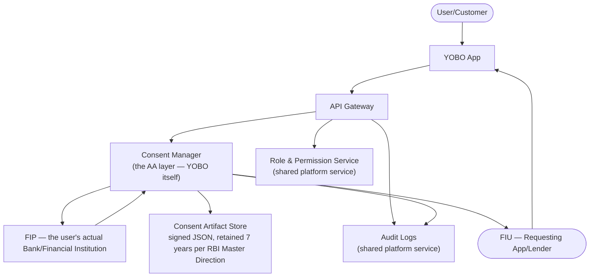
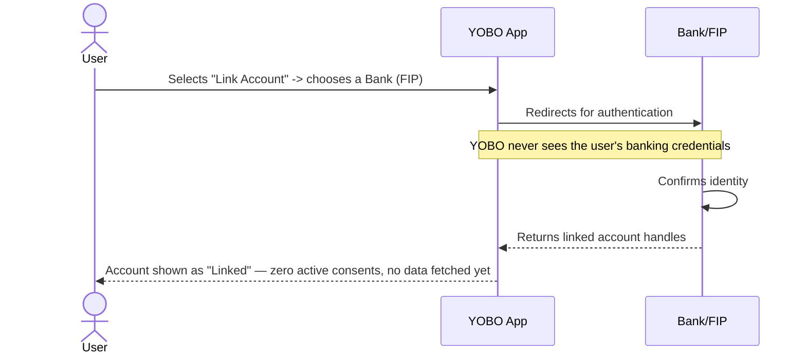
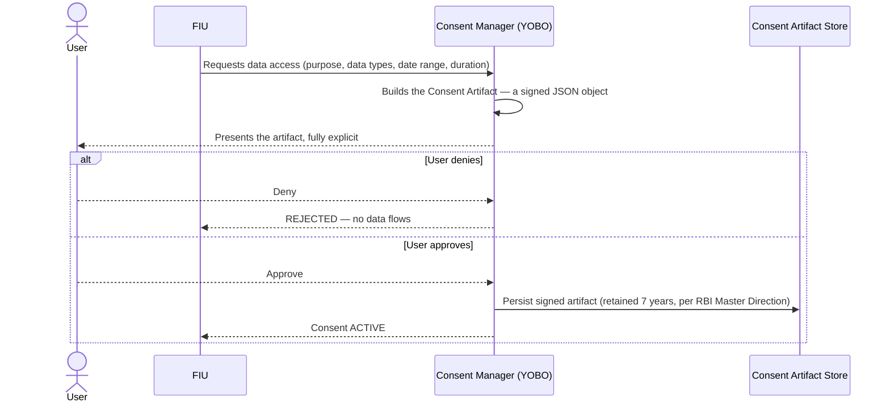
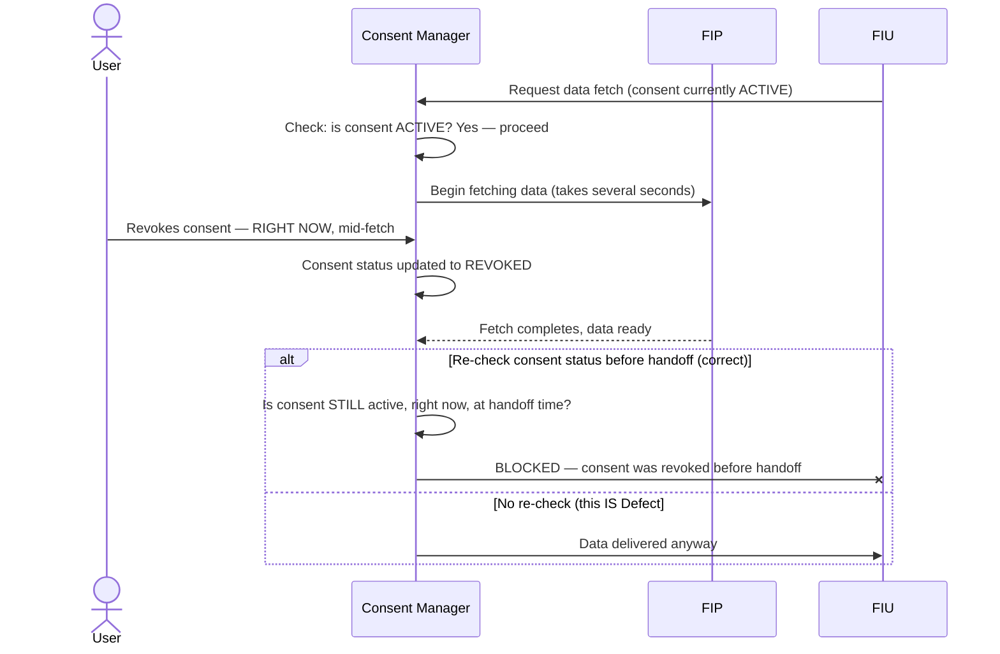
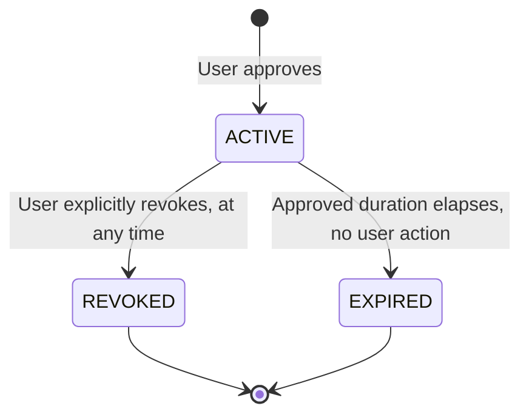

# YOBO — Architecture & Flow

> See [`business-overview.md`](./business-overview.md) for the AA/FIP/FIU role definitions this
> flow relies on, [`tech-and-skills.md`](./tech-and-skills.md) for the tools and skills behind
> this testing approach, and [`README.md`](./README.md) for the full documentation map.
>
> Every diagram below is drawn in [Mermaid](https://mermaid.js.org/), which GitHub renders
> natively in-page — nothing here requires opening another site or tool to read it.

## 1. System Architecture — Who Talks to Whom

**Why YOBO itself is labeled "the AA layer," not "the data owner":** per
[`business-overview.md`](./business-overview.md) section 3, YOBO is a licensed intermediary
operating under RBI's Master Direction on NBFC-Account Aggregators — it orchestrates consent and
data flow between the FIP and FIU but is a conduit, not a warehouse. The real technical protocol
every AA, FIP, and FIU implements is published by ReBIT (RBI's IT arm), with Sahamati (recognized
by RBI in 2026 as the AA ecosystem's self-regulatory organization) coordinating interoperability
across participants — this isn't a loosely-analogous "like Cred or Finvu" pattern, it's the same
real regulatory and technical framework those products run on.

## 2. Account Linking Flow

**Key testing principle:** linking and consenting are two separate actions — `TC-003` in
[`regression-checklist.md`](../regression-checklist.md) exists specifically because a
linked-but-unconsented account must never leak data to an FIU.

## 3. The Consent Artifact, Concretely

The Consent Artifact isn't just a UI screen — it's a real, structured, digitally-signed object
every party in the flow validates independently:

**What the artifact actually contains, per the real AA technical specification** — not an
invented simplification:

| Field | What It Constrains |
|---|---|
| Purpose | Why the data may be used (e.g., loan underwriting) — not a free-text label, a defined, machine-readable code |
| Data Types | Which financial data categories are covered (e.g., deposit account transactions) |
| Date Range | The historical window of data the FIU may access |
| Fetch Frequency | How often the FIU may re-fetch (one-time vs. periodic) |
| **Data Life After Fetch** | How long the FIU may *retain* data it already received — a separate boundary from the consent's own active window |
| FIP / FIU / AA IDs | The exact three parties this specific artifact binds |

**Why "Data Life After Fetch" is easy to miss and genuinely important:** `TC-009` and the
revocation tests in section 5 below both focus on whether data *flows* correctly — but the
artifact also constrains how long an FIU may *keep* data already delivered. A platform that gets
fetch-time scoping perfectly right but never enforces or audits the FIU's post-fetch retention
promise has only covered half of what the artifact actually commits to.

## 4. The Real Mechanism Behind Defect #1 — Revocation as a Race Condition

[`sample-defect-report.md`](../sample-defect-report.md) Defect #1 (an in-flight fetch completing
after revocation) is structurally the same problem this portfolio has already named twice in
completely different domains — the Travel Marketplace repo's overbooking race and BBPS's
stale-price check: **a check that runs once, at the start of an operation, isn't enough when the
operation takes long enough for the world to change underneath it.**

**Why the fix is "check again at handoff," not "check faster at the start":** the request-time
check was never wrong — it was simply answering a question ("is consent active *right now*") that
stops being the right question the moment any real time passes before the operation finishes. The
correct pattern, matching [`sample-defect-report.md`](../sample-defect-report.md)'s suggested
fix, is to treat revocation as something that can interrupt a fetch already in flight — re-verify
consent validity at the exact moment data would be handed to the FIU, not only when the fetch was
first requested.

## 5. Revoked vs. Expired — Two Different Terminal States, Not One

**Why collapsing both into one "Inactive" status (as in
[`sample-defect-report.md`](../sample-defect-report.md) Defect #2) is a real compliance problem,
not just a labeling nicety:** `REVOKED` is evidence of a deliberate user action — exactly what a
compliance reviewer needs to confirm the user's own revocation request was actually honored.
`EXPIRED` is a passive timeout with no user action at all. A Consent History view that can't
distinguish them removes the one piece of evidence that would let a user (or an auditor) verify
their own revocation actually took effect — which, for a product whose entire value proposition
is revocable, auditable consent, undermines the core guarantee the same way a silently-failing
revocation check would.

## 6. FIP Integration Variability — A Cross-Bank Consistency Risk

Not every linked FIP returns data in a perfectly uniform shape or at the same latency. This is
conceptually the same risk category as BBPS's biller-integration variability (see the
[BBPS repository](https://github.com/ghanendra-sdet/bbps-bill-payment-platform)): a defect that
only manifests for accounts linked to specific FIPs, invisible if testing only ever uses one
"reference" bank's dummy data — see [`regression-checklist.md`](../regression-checklist.md)
section 4.

---

**Sources for the real-world regulatory framework referenced above** (used to ground this
document's diagrams in the genuine RBI Account Aggregator ecosystem, not an invented one):
[RBI Master Direction on NBFC-Account Aggregators & DEPA — HyperVerge](https://hyperverge.co/blog/account-aggregator-framework-rbi/),
[Sahamati's recognition as AA ecosystem SRO & the consent artifact spec — Sahamati](https://sahamati.org.in/account-aggregator-key-resources/).
