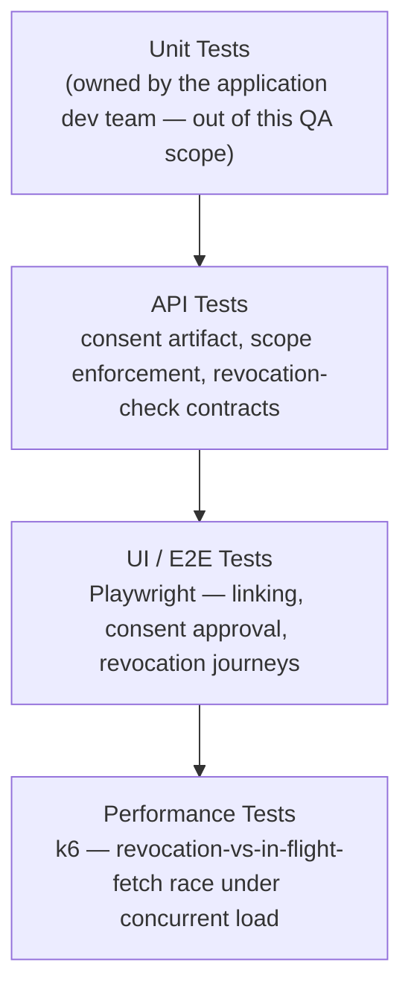
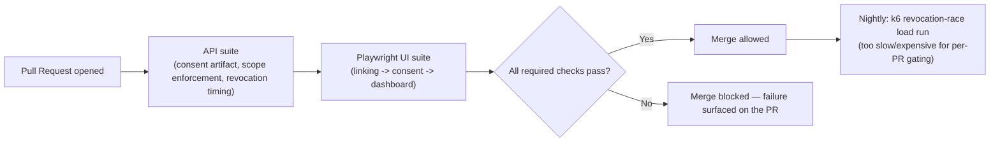

# YOBO — Tech Stack & Skills Demonstrated

> Everything in this doc is answerable by reading this repo alone — no need to visit an external
> site to understand what was used or why. See [`business-overview.md`](./business-overview.md)
> for the product/module breakdown and [`architecture-and-flow.md`](./architecture-and-flow.md)
> for how the system actually behaves.

## 1. Full Tech Stack, and Why Each Tool

| Category | Tool | Why This Tool Specifically |
|---|---|---|
| **UI Automation** | Playwright + TypeScript | Strong network-interception/timing control — essential here specifically because simulating a mid-fetch revocation (section 4 of [`architecture-and-flow.md`](./architecture-and-flow.md)) requires precise control over request timing |
| **API Testing & Automation** | Playwright API requests, Postman | Validates consent-artifact construction, scope enforcement, and revocation-check timing directly against the contract |
| **Performance Testing** | k6 | Load testing for the revocation race condition at scale (section 5 below) — chosen to stay in the same JS ecosystem as Playwright |
| **CI/CD** | Jenkins / GitHub Actions | Automates the regression suite on a schedule/trigger — see section 4 for the suggested pipeline shape |
| **Bug Tracking** | JIRA | Full defect lifecycle tracking — see [`../sample-defect-report.md`](../sample-defect-report.md) |
| **Version Control** | Git, GitHub | This repo itself; diagrams throughout are Mermaid, which GitHub renders natively with zero extra tooling |

## 2. Skills Demonstrated — Skill → Where to See It

| Skill | Demonstrated By | Where to Look |
|---|---|---|
| **Manual / Functional Testing** | Full account-linking-to-revocation regression suite | [`../regression-checklist.md`](../regression-checklist.md) |
| **API Testing** | Consent artifact generation, data-fetch scope enforcement, revocation-check timing | [`../regression-checklist.md`](../regression-checklist.md) sections 2–3 |
| **UI Automation** | Playwright spec covering account linking and consent approval | [`../automation/sample-consent-flow.spec.ts`](../automation/sample-consent-flow.spec.ts) |
| **Timing-Precise Negative Testing** | A dedicated test category for the exact in-flight-fetch-vs-revocation race condition, not just "does revocation eventually work" | [`../regression-checklist.md`](../regression-checklist.md) `TC-011`; [`../sample-defect-report.md`](../sample-defect-report.md) Defect #1 |
| **Performance Testing** | k6-based load testing for the revocation race condition under concurrent fetch volume | Section 5 below |
| **Cross-Integration Consistency Testing** | A dedicated test category treating FIP variability as its own dimension, not an edge case | [`../regression-checklist.md`](../regression-checklist.md) section 4 |
| **Requirement Traceability (RTM)** | A worked requirement → test case → status mapping | [`../sample-rtm.md`](../sample-rtm.md) |
| **Defect Management & Root-Cause Analysis** | Worked defects identifying the actual mechanism (a check that runs once at fetch start, never re-verified at handoff) rather than just the symptom | [`../sample-defect-report.md`](../sample-defect-report.md) |
| **Test Reporting & Metrics** | A structured execution summary with pass/fail breakdown by area | [`../regression-execution-summary.md`](../regression-execution-summary.md) |
| **Technical Documentation & Communication** | This entire `docs/` set | This doc set, start to finish |

## 3. The Testing Pyramid Applied to This Project

**Why this top layer is a race-condition test, not a generic load test:** per section 4 of
[`architecture-and-flow.md`](./architecture-and-flow.md), the defect this layer exists to catch
only has a realistic chance of reproducing when a meaningful number of fetches are genuinely
in-flight *at the same moment* a revocation lands — a single sequential test can assert the
*logic* is correct, but only concurrent load gives the race condition enough chances to actually
occur if the logic has a gap.

## 4. CI/CD — Suggested Pipeline Shape

> **Note on scope, matching this repo's existing honesty convention** (see
> [`../automation/README.md`](../automation/README.md)): this repo includes one representative
> Playwright spec rather than the full framework, to stay focused as a portfolio piece. The
> pipeline below is the **suggested shape** that automation is designed to slot into, not a claim
> that a live CI instance with this exact pipeline is currently running against this repo.

## 5. Performance Testing, In Depth

This platform's performance risk isn't primarily about raw throughput — it's about whether its
single most safety-critical guarantee (revocation stops data flow, even mid-fetch) survives
**concurrent** load, not just the single, sequential timing window a functional test can
construct by hand.

| Test Type | What It Targets | Why It Matters Here Specifically |
|---|---|---|
| **Concurrent revocation-race load test** | Many simulated fetches in flight simultaneously, with a subset deliberately revoked mid-fetch | The exact mechanism behind Defect #1 — a handoff-time re-check that works correctly for one isolated fetch could still have a subtle timing gap that only surfaces when many fetches and revocations are landing close together |
| **Load test** | Sustained data-fetch volume across many concurrently active consents | Data Aggregation (section 1 of [`architecture-and-flow.md`](./architecture-and-flow.md)) is the highest-volume path in the platform — a bottleneck here affects every active consent at once |
| **Spike test** | A sudden surge in consent requests (e.g., a lending partner's own marketing campaign driving many users to link accounts at once) | FIU-driven demand is bursty and outside YOBO's own control — a partner's campaign success is this platform's traffic spike trigger |

**What this is deliberately not:** a claim that this is the same kind of "two requests race for
one winner" problem as the Reseller platform's tenant-isolation test or the Travel Marketplace's
overbooking test. Those are about *exactly one* request winning a contested resource. This is
about a *correctness check* (is consent still valid?) staying reliable under load, regardless of
how many other operations are happening at the same time — a related but distinct testing
concern, worth naming precisely rather than reusing the wrong mental model from this portfolio's
other repos.

## 6. Why This Doc Exists Separately From business-overview.md

[`business-overview.md`](./business-overview.md) answers *what* this module is and *why* its
risk model looks the way it does. This doc answers a different question — *how* that gets tested
and with what tools — so a reader scanning for technical/skill evidence doesn't have to filter it
out of the business-context narrative, and vice versa.
